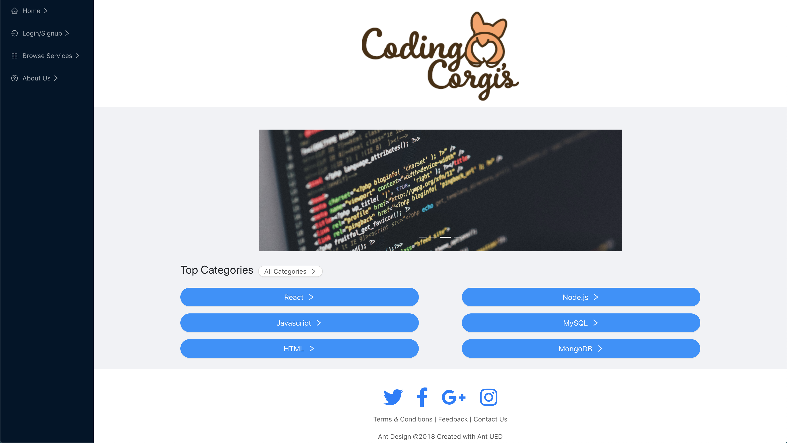

# Coding Corgi's E-Commerce Application

## Description 
Coding Corgi's is an E-Commerce application built by Coding Bootcamp Students. 

Our team was inspired by the idea of this application being similar to Uber for website developers. Providing a platform for professionals to monetize their skills on a contractual basis, and customers the ability to purchase hourly coding services. 

Coding Corgi's has a standard E-Commerce model. The customer can create an account, browse services, add to cart, and checkout. Once a purchase is made, a confirmation email with purchase details is sent. The customer can view their purchase history when logged in. Although we still have future developments that must be implemented to have the site functioning in a real-world scenario, this application demonstrates my team's ability to build complex applications that utilize front and back end logic.

## Customer Story 
AS A user who needs to hire a Developer on a contractual basis, 
I WANT to easily browse/purchase services that fit my needs, 
SO time and money that would go into the hiring process are saved.

## Deployment 
    * [Heroku](https://coding-corgis.herokuapp.com/)
    * [Github](https://github.com/akuranz/project-3)
   
## Future Development 
    * Connect to Stripe for online payment processing
    * Customers ability to submit reviews 
    * Online Chat Support.
    * Developer login to post services 
    * Developer profile.

## Credits

__Collaborators:__
    * [Ambers's GitHub](https://github.com/ambernina)
    * [Catalina's GitHub](https://github.com/catalinarose1361)
    * [Abby's GitHub](https://github.com/akuranz)
    * [Neena's GitHub](https://github.com/Neenajohnbritto)

__Built Using:__
    * [React](https://reactjs.org/)
    * [Node.js](https://nodejs.org/en/)
    * [Mongoose](https://mongoosejs.com/docs/)
    * [Nodemailer](https://nodemailer.com/about/)
    * [Ant Design](https://ant.design/)
    * [Passport](http://www.passportjs.org/)
    * [Express](https://expressjs.com/)
    * [React Toastify](https://www.npmjs.com/package/react-toastify)

__Logo Created By Amber Robinson:__
  * [Ambers's GitHub](https://github.com/ambernina)

## License

The MIT License (MIT)

Permission is hereby granted, free of charge, to any person obtaining a copy
of this software and associated documentation files (the "Software"), to deal
in the Software without restriction, including without limitation the rights
to use, copy, modify, merge, publish, distribute, sublicense, and/or sell
copies of the Software, and to permit persons to whom the Software is
furnished to do so, subject to the following conditions:

The above copyright notice and this permission notice shall be included in all
copies or substantial portions of the Software.

THE SOFTWARE IS PROVIDED "AS IS", WITHOUT WARRANTY OF ANY KIND, EXPRESS OR
IMPLIED, INCLUDING BUT NOT LIMITED TO THE WARRANTIES OF MERCHANTABILITY,
FITNESS FOR A PARTICULAR PURPOSE AND NONINFRINGEMENT. IN NO EVENT SHALL THE
AUTHORS OR COPYRIGHT HOLDERS BE LIABLE FOR ANY CLAIM, DAMAGES OR OTHER
LIABILITY, WHETHER IN AN ACTION OF CONTRACT, TORT OR OTHERWISE, ARISING FROM,
OUT OF OR IN CONNECTION WITH THE SOFTWARE OR THE USE OR OTHER DEALINGS IN THE
SOFTWARE.
